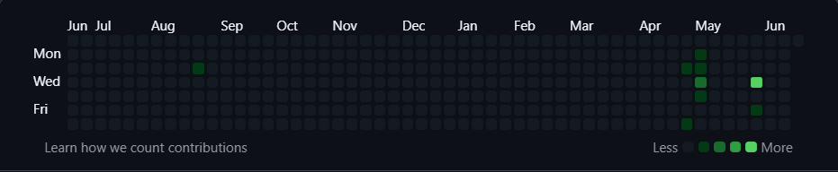
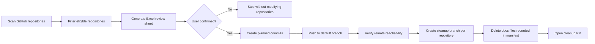

<h1>
  Fill-Contributions-Graph | GitHub Green Wall Painting Plan
</h1>

---

<p align="center">
  <strong>Evidence-first GitHub Contribution Graph Refill Forge</strong>
</p>

<p align="center">
  <a href="./LICENSE"></a>
  
  
  
  
  
</p>

<p align="center">
  English · Review first · Push before cleanup
</p>

<p align="center">
  <a href="./README.md">简体中文</a>
</p>

---

## Why This Exists

Is the GitHub Contribution Graph looking empty? This is the tool for that: a cyber tree-planting and reforestation plan.

<p align="center">
  
</p>

The GitHub contribution graph only counts commits that have reached a GitHub repository, are on the default branch or the `gh-pages` branch, and have an author email that can be attributed to the account. Running `git commit` locally will not change the contribution graph; commits that are not pushed will not be counted by GitHub either.

`fill-contributions-graph` breaks cross-repository maintenance work into an auditable, executable, and traceable process. It does not trigger implicitly, nor does it jump straight into creating commits. Instead, it first generates an Excel review sheet so the user can confirm dates, commit counts, repository distribution, and commit details.

Core strategies:

- **Excel-first**: before any execution, an Excel review sheet must be generated and the user must explicitly confirm it.
- **existing-commit-aware**: first query the author's existing commit count on GitHub for the same day, then deduct it from the planned new count.
- **push-then-cleanup**: during execution, commits must first be pushed to the GitHub default branch and verified as reachable on the remote; then a separate cleanup PR is created for each repository to remove the generated `docs/` files.

## How It Works

1. Explicitly invoke `fill-contributions-graph` or `$fill-contributions-graph`.
2. Check `gh`, GitHub login status, and API connectivity.
3. Scan account repositories, excluding forked and archived repositories by default.
4. Require eligible repositories `> 10`.
5. Use the activity profile to generate active days and target commit counts per day.
6. Query existing author commits for each day and deduct them:

```python
planned_new_commit_count = max(0, target_commit_count - existing_author_commit_count)
```

7. Output an Excel review sheet.
8. Execute only after the user confirms.
9. Create the planned commits, `push` them to the default branch, and verify that the remote contains the commits.
10. Create a separate cleanup PR for each affected repository to delete the generated `docs/` files from this run.

## Execution Flow



## Execution Modes

| Mode | Purpose | Modify repository files | Push to GitHub | Typical output |
| --- | --- | --- | --- | --- |
| `plan-only` | Generate only the Excel review plan | No | No | Excel / TSV review sheet |
| `push-and-cleanup-pr` | Execute the full flow after user confirmation | Yes | Yes | pushed commits, cleanup PR, manifest |
| `cleanup-pr` | Create only cleanup PRs from an existing manifest | Yes, only on cleanup branches | Yes, only push cleanup branches | cleanup PR URL, deleted file statistics |

## Quick Start

Generate a daily aggregate review sheet:

```powershell
python .\scripts\generate_plan.py `
  --account VectorPeak `
  --start 2026-03-01 `
  --end 2026-04-01 `
  --profile vibe_coding_builder `
  --excel-out plan.xls
```

Export per-commit details:

```powershell
python .\scripts\generate_plan.py `
  --account VectorPeak `
  --start 2026-03-01 `
  --end 2026-04-01 `
  --granularity commit `
  --excel-out commit-detail.xls `
  --out commit-detail.tsv
```

`--end` uses left-closed, right-open semantics. To include `2026-03-31`, pass `--end 2026-04-01`.

## Output Format

Default Excel review sheet fields:

```text
Date | Target commits | Existing author commits | Planned new commits | Commit details
```

Per-commit detail fields:

```text
date | time | repo | kind | task_type | message | path | summary | target_commit_count | existing_commit_count | planned_new_commit_count
```

The planning script is only responsible for generating review materials. It does not `commit`, `push`, or create cleanup PRs.

Example Excel review sheet:

| Date | Target commits | Existing author commits | Planned new commits | Commit details |
| --- | ---: | ---: | ---: | --- |
| 2026-03-05 | 4 | 1 | 3 | `21:10 KnowFoundry-RAG-Console docs: add retrieval notes`; `22:35 LLM-Wiki analysis: record validation split`; `23:18 OpenSense tests: document smoke test plan` |
| 2026-03-08 | 3 | 0 | 3 | `10:24 carbon-tower-predictor model: add lag feature notes`; `16:40 vectorpeak-blogs docs: add topic notes`; `20:05 kaggle-tabular-forge eval: add baseline checklist` |

## Cleanup PR

Execution mode uses `push-and-cleanup-pr`:

- Push the planned commits to each repository's default branch first.
- Verify that each commit is reachable from the remote default branch.
- Create one cleanup branch for each affected repository.
- Delete the generated files recorded in the manifest.
- Commit and push the cleanup branch.
- Open one draft PR for each repository.

A GitHub PR can only belong to one repository, so cross-repository cleanup requires one cleanup branch and one cleanup PR per affected repository.

Common generated directories:

```text
docs/notes/
docs/testing/
docs/config/
docs/maintenance/
docs/evaluation/
docs/editorial/
docs/experiments/
docs/review/
```

## Directory Structure

```text
fill-contributions-graph/
|-- SKILL.md
|-- README.md
|-- README.en.md
|-- LICENSE
|-- agents/
|   `-- openai.yaml
|-- references/
|   `-- activity-profiles.md
`-- scripts/
    `-- generate_plan.py
```

## Notes

- It can only be triggered explicitly; ordinary discussions about GitHub, commits, contribution graphs, or green walls must not start it implicitly.
- After generating the Excel file, the workflow must wait for user confirmation and must not enter execution directly.
- The default flow does not use `git revert` for rollback, nor `reset --hard + force push`.
- History rewriting is treated only as incident recovery experience, not as a regular execution path.
- It does not create empty commits, write temporary placeholder code, or generate fake content that is deleted immediately after committing.
- If a dirty worktree already exists locally for the same repository, ask the user whether to use an isolated clone first.

## FAQ

### Why do local commits not count as contributions?

The GitHub contribution graph counts contribution events that exist on GitHub's servers and can be attributed to the account. If `git commit` is only run locally, GitHub does not know that commit exists, so it will not be counted in the contribution graph.

### Why is push required?

A commit must reach a GitHub repository, and usually must be on the default branch or the `gh-pages` branch, before it can be counted by the contribution graph. A commit that is not pushed will not be counted by GitHub.

### Why is there one cleanup PR per repository?

A GitHub PR can only belong to one repository and cannot submit the same PR across multiple repositories. When executing across repositories, each affected repository needs its own cleanup branch and cleanup PR.

### Why might the GitHub contribution graph refresh with a delay?

The contribution graph is not recomputed synchronously after every push. GitHub processes commit attribution, branch reachability, email matching, PR/issue events, and other contribution events asynchronously, so the page may show caching or delay.
